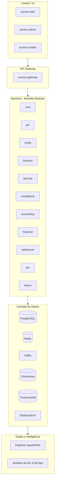

# AUREUS - Big Picture

A AUREUS é uma plataforma de Core Banking completa e moderna, desenvolvida para o mercado brasileiro. Este documento fornece uma visão de alto nível sobre o propósito da plataforma, sua arquitetura e diferenciais competitivos.

---

## 🏛️ Identidade e Missão

O nome **AUREUS** remete à moeda de ouro do Império Romano, simbolizando os pilares da nossa plataforma: **Estabilidade, Valor, Confiança e Padrão**.

**Slogan**: *"O padrão de excelência financeira."*

Nossa missão é fornecer uma infraestrutura financeira de classe mundial que combina a robustez dos sistemas legados com a agilidade e inovação das tecnologias cloud-native.

## 🚀 Diferenciais Competitivos

A AUREUS foi desenhada para superar as limitações das soluções tradicionais:
- **Performance Superior**: Arquitetura otimizada para processamento de transações em massa com baixa latência.
- **APIs Modernas**: Abordagem *API-First*, facilitando a integração e reduzindo o *time-to-market*.
- **Conformidade Nativa**: Módulos dedicados para atender a todas as exigências do BACEN e normas regulatórias brasileiras desde o primeiro dia.
- **Evolução Contínua**: Preparada para o futuro com uma stack de dados de última geração (Data Lakehouse).

---

## 👷 Para Quem

- **Instituições Financeiras**: Que buscam modernizar seu core banking com segurança e conformidade (BACEN, LGPD).
- **Equipes de Tecnologia**: Que precisam de uma base sólida e modular, com backend, frontends, dados e ML integrados e bem documentados.

---

## 🏗️ Visão da Arquitetura

### Componentes Chave:
- **Canais**: Interfaces modernas em React (Web/Admin) e React Native (Mobile).
- **Gateway**: Ponto único de entrada, gerenciando autenticação, roteamento e segurança.
- **Backend Modular**: Lógica de negócio distribuída em módulos coerentes, permitindo evolução para microserviços.
- **Dados**: Mix ideal de bancos transacionais (PostgreSQL), cache (Redis) e analíticos (ClickHouse/Elasticsearch).
- **Inteligência**: Pipelines automatizados e modelos de IA para detecção de fraude e análise de risco.

---

## 🛠️ Stack Tecnológica

- **Backend**: Java 25, Spring Boot 4.1, Spring Cloud Gateway, JPA.
- **Frontend**: React 18, Material-UI, React Native.
- **Dados**: PostgreSQL, Redis, Kafka, ClickHouse, Elasticsearch.
- **Operações**: Docker, Maven, Git, Apache Spark, Airflow.
- **Inteligência**: Python, FastAPI, MLflow.

---

## 🧭 Onde Encontrar Mais

| Tema | Documento |
|------|-----------|
| Guia Geral | [../README.md](../README.md) |
| Roadmap e Visão | [./roadmap.md](./roadmap.md) |
| Detalhes da Arquitetura | [../02-technical/arquitetura/visao-geral.md](../02-technical/arquitetura/visao-geral.md) |
| Operação e Infra | [../05-infrastructure/infrastructure/index.md](../05-infrastructure/infrastructure/index.md) |
| APIs e Integração | [../03-development/portal-desenvolvedor/README.md](../03-development/portal-desenvolvedor/README.md) |

---

**AUREUS Core Banking Platform** - *O padrão de excelência financeira*
