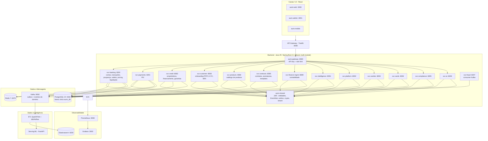
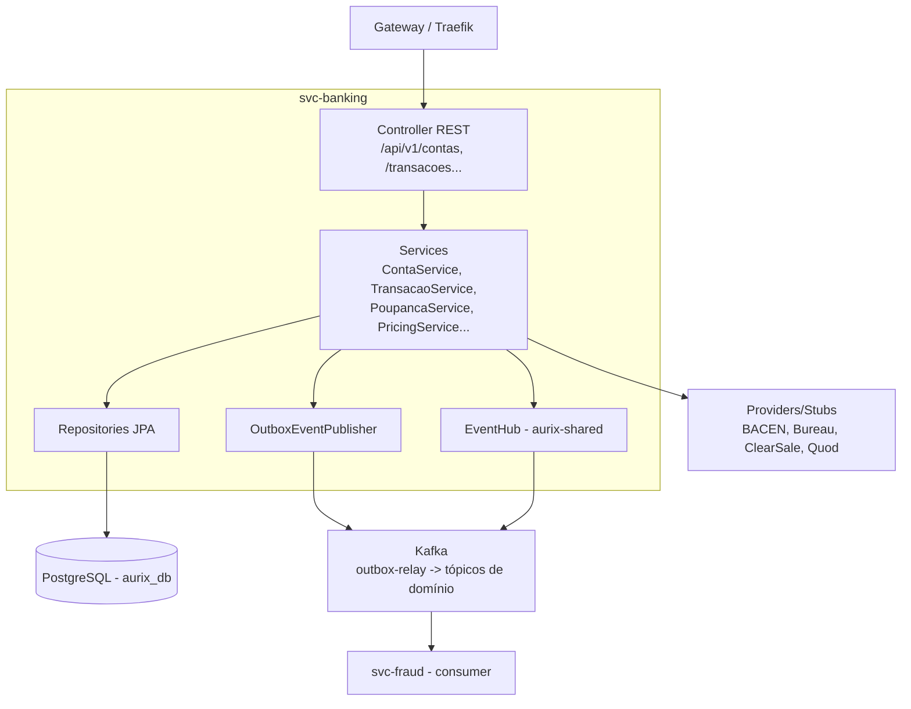

# Diagramas C4 – AURIX Core Banking Platform

Diagramas C4 (Context, Container, Component) em Mermaid, mantidos em sincronia com a arquitetura real (14 serviços `svc-*` + `aurix-gateway` + `aurix-shared`).

> Portas de referência (fonte: `aurix-infrastructure/docker-compose.yml` e `application.yml` de cada serviço).

## 1. Context (L0)

```mermaid
flowchart TB
  PF[Cliente Pessoa Física] --> WEB[aurix-web]
  PJ[Cliente Pessoa Jurídica] --> WEB
  WEB --> G[API Gateway Traefik :8080]
  ADM[Operação / Back-office] --> ADMIN[aurix-admin]
  ADMIN --> G
  MOB[Cliente Mobile] --> MOBILE[aurix-mobile]
  MOBILE --> G

  subgraph Sistema[AURIX Core Banking Platform]
    G --> SVC[Serviços svc-* (14 domínios)]
    SVC --> PG[(PostgreSQL 15)]
    SVC --> RD[(Redis 7)]
    SVC --> K[Kafka]
  end

  SVC --> BACEN[BACEN / SPB - mock :8095]
  SVC --> RF[Receita Federal]
  SVC --> BUR[Bureaus / ClearSale / Quod]
  SVC --> KC[Keycloak IAM :8443]

  K --> DP[Pipelines Spark/Flink]
  DP --> CH[(ClickHouse)]
  DP --> TS[(TimescaleDB)]
  DP --> ES[(Elasticsearch)]
  DP --> ML[Modelos de ML - FastAPI :50051 gRPC]
```

## 2. Container (L1)



## 3. Component (L2) – exemplo `svc-banking`

O `svc-banking` segue o padrão **Controller → Service → Repository** e contém os sub-domínios `poupanca/`, `salario/`, `pricing/`, `settlement/` e `payment/`.



---

**Última atualização**: Agosto 2026  
**Fonte**: [visao-geral.md](visao-geral.md), [docker-compose.yml](../../05-infrastructure/infrastructure/index.md)
