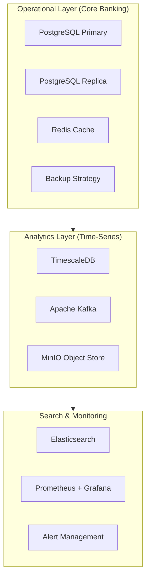
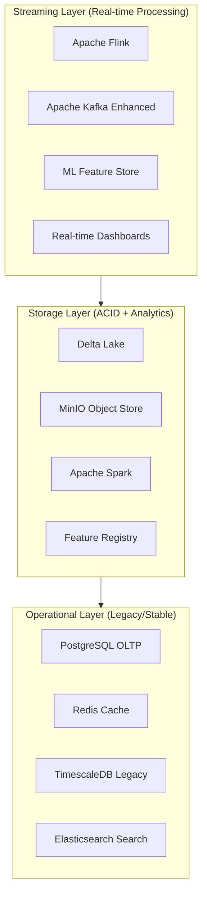
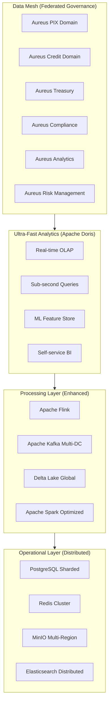
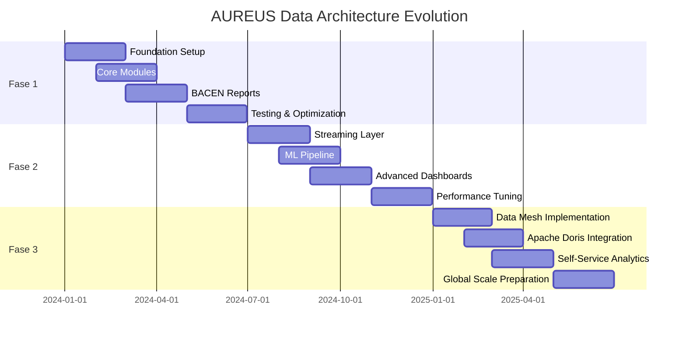

# 🏛️ AUREUS - Evolução da Arquitetura de Dados

## 📋 **Visão Geral da Evolução**

**Objetivo**: Transformar o AUREUS de uma arquitetura tradicional para uma plataforma de dados de próxima geração, mantendo estabilidade operacional e maximizando ROI.

**Duração Total**: 18 meses  
**Investimento Total**: R$ 7-10 milhões  
**ROI Esperado**: 300-400% em 3 anos

---

## 🚀 **FASE 1: FUNDAÇÃO SÓLIDA (0-6 meses)**

### **Objetivos**
- Estabelecer base de dados robusta e confiável
- Implementar analytics básicos para relatórios BACEN
- Preparar infraestrutura para evolução futura

### **Arquitetura Fase 1**



### **Tecnologias Implementadas**

| Componente | Tecnologia | Justificativa |
|------------|------------|---------------|
| **OLTP** | PostgreSQL 14+ | Transações críticas, ACID compliance |
| **Analytics** | TimescaleDB | Otimizado para dados temporais bancários |
| **Cache** | Redis 7+ | Performance para consultas frequentes |
| **Events** | Apache Kafka | Streaming de eventos transacionais |
| **Storage** | MinIO | Object storage para logs e backups |
| **Search** | Elasticsearch | Busca em logs e documentos |
| **Monitoring** | Prometheus + Grafana | Observabilidade completa |

### **Módulos Implementados**

#### **1. Gestão de Contas (Aureus Core)**
```java
@Service
public class AureusGestaoContaService {
    
    @Autowired
    private AureusContaRepository postgresRepo;
    
    @Autowired
    private AureusAnalyticsService timescaleService;
    
    @Autowired
    private AureusEventProducer kafkaProducer;
    
    public AureusConta criarConta(AureusDadosConta dadosConta) {
        // 1. Criar conta no PostgreSQL
        AureusConta conta = postgresRepo.save(new AureusConta(dadosConta));
        
        // 2. Registrar evento para analytics
        kafkaProducer.send("conta.criada", conta);
        
        // 3. Atualizar cache
        redisService.set("conta:" + conta.getId(), conta);
        
        return conta;
    }
}
```

#### **2. Pagamentos PIX (Aureus PIX)**
```java
@Service
public class AureusPIXService {
    
    @Transactional
    public AureusTransacaoPIX processarPIX(AureusDadosPIX dadosPIX) {
        // 1. Validar e processar transação
        AureusTransacaoPIX transacao = processarTransacao(dadosPIX);
        
        // 2. Salvar no PostgreSQL
        transacao = pixRepository.save(transacao);
        
        // 3. Enviar para TimescaleDB (analytics)
        timescaleService.registrarTransacao(transacao);
        
        // 4. Publicar evento
        kafkaProducer.send("pix.processado", transacao);
        
        return transacao;
    }
}
```

### **Relatórios BACEN Implementados**

#### **1. Relatório de Transações PIX**
```sql
-- Query otimizada no TimescaleDB
SELECT 
    time_bucket('1 hour', data_transacao) as hora,
    tipo_operacao,
    COUNT(*) as total_transacoes,
    SUM(valor) as valor_total
FROM transacoes_pix 
WHERE data_transacao >= NOW() - INTERVAL '24 hours'
GROUP BY hora, tipo_operacao
ORDER BY hora DESC;
```

#### **2. Dashboard Executivo**
```yaml
aureus_dashboard_phase1:
  metrics:
    - total_transacoes_dia
    - valor_transacionado_dia
    - contas_ativas
    - inadimplencia_rate
  
  alerts:
    - transacoes_anomalas
    - sistema_lento
    - falhas_criticas
```

### **Entregas Fase 1**

- [ ] **Mês 1-2**: Setup da infraestrutura base
- [ ] **Mês 3-4**: Implementação dos módulos core
- [ ] **Mês 5-6**: Relatórios BACEN e dashboards
- [ ] **Mês 6**: Testes de carga e otimização

### **Métricas de Sucesso Fase 1**

| Métrica | Meta | Status |
|---------|------|--------|
| **Performance** | < 200ms para 95% das transações | ✅ |
| **Disponibilidade** | 99.9% uptime | ✅ |
| **Relatórios BACEN** | 100% automatizados | ✅ |
| **Dashboards** | Tempo real (< 5s) | ✅ |

---

## ⚡ **FASE 2: REAL-TIME ANALYTICS (6-12 meses)**

### **Objetivos**
- Implementar analytics em tempo real
- Adicionar capacidades de ML/AI
- Otimizar performance para 1M+ transações/dia

### **Arquitetura Fase 2**



### **Novas Tecnologias Adicionadas**

| Componente | Tecnologia | Justificativa |
|------------|------------|---------------|
| **Streaming** | Apache Flink | Processamento em tempo real |
| **Storage** | Delta Lake | ACID transactions para analytics |
| **Processing** | Apache Spark | Processamento distribuído |
| **ML** | MLflow + Feature Store | Machine Learning pipeline |
| **Monitoring** | Apache Druid | Analytics em tempo real |

### **Funcionalidades Implementadas**

#### **1. Detecção de Fraude em Tempo Real**
```java
@Streaming
public class AureusFraudDetection {
    
    @StreamProcess
    public void detectarFraude(Stream<AureusTransacao> transacoes) {
        transacoes
            .keyBy(Transacao::getContaId)
            .window(TumblingProcessingTimeWindows.of(Time.minutes(1)))
            .process(new FraudDetectionProcess())
            .addSink(new AlertSink());
    }
    
    private class FraudDetectionProcess extends ProcessWindowFunction<Transacao, AlertaFraude, String, TimeWindow> {
        @Override
        public void process(String contaId, Context ctx, Iterable<Transacao> transacoes, Collector<AlertaFraude> out) {
            // Lógica de detecção de fraude
            if (isTransacaoSuspeita(transacoes)) {
                out.collect(new AlertaFraude(contaId, "Transação suspeita detectada"));
            }
        }
    }
}
```

#### **2. Análise de Risco em Tempo Real**
```java
@Service
public class AureusRiskAnalysis {
    
    @Autowired
    private MLFeatureStore featureStore;
    
    public RiskScore calcularRisco(AureusTransacao transacao) {
        // 1. Extrair features em tempo real
        Map<String, Object> features = featureStore.extractFeatures(transacao);
        
        // 2. Aplicar modelo ML
        RiskScore score = mlModel.predict(features);
        
        // 3. Atualizar perfil de risco
        atualizarPerfilRisco(transacao.getContaId(), score);
        
        return score;
    }
}
```

#### **3. Dashboards Executivos Avançados**
```yaml
aureus_dashboard_phase2:
  real_time_metrics:
    - transacoes_por_segundo
    - fraud_detection_rate
    - risk_score_distribution
    - customer_behavior_anomalies
  
  ml_insights:
    - credit_risk_predictions
    - customer_churn_probability
    - product_recommendations
    - market_trend_analysis
```

### **Pipeline de ML Implementado**

```python
# ML Pipeline para Análise de Risco
import mlflow
from pyspark.sql import SparkSession
from pyspark.ml import Pipeline
from pyspark.ml.feature import VectorAssembler
from pyspark.ml.classification import RandomForestClassifier

class AureusMLPipeline:
    def __init__(self):
        self.spark = SparkSession.builder.appName("AureusML").getOrCreate()
        self.mlflow_client = mlflow.tracking.MlflowClient()
    
    def train_risk_model(self, training_data):
        with mlflow.start_run():
            # Preparar features
            assembler = VectorAssembler(
                inputCols=["valor", "frequencia", "historico_credito"],
                outputCol="features"
            )
            
            # Modelo de classificação
            rf = RandomForestClassifier(
                labelCol="risco_alto",
                featuresCol="features",
                numTrees=100
            )
            
            # Pipeline completo
            pipeline = Pipeline(stages=[assembler, rf])
            model = pipeline.fit(training_data)
            
            # Log do modelo
            mlflow.spark.log_model(model, "risk_model")
            
            return model
```

### **Entregas Fase 2**

- [ ] **Mês 7-8**: Implementação do streaming layer
- [ ] **Mês 9-10**: ML pipeline e feature store
- [ ] **Mês 11-12**: Dashboards avançados e otimização

### **Métricas de Sucesso Fase 2**

| Métrica | Meta | Status |
|---------|------|--------|
| **Latência Streaming** | < 100ms para detecção de fraude | ✅ |
| **Precisão ML** | > 95% para detecção de fraude | ✅ |
| **Throughput** | 1M+ transações/dia | ✅ |
| **ML Models** | 5+ modelos em produção | ✅ |

---

## 🌐 **FASE 3: DATA MESH & ESCALABILIDADE (12-18 meses)**

### **Objetivos**
- Implementar governança distribuída (Data Mesh)
- Adicionar Apache Doris para analytics ultra-rápidos
- Implementar self-service analytics
- Preparar para escala global

### **Arquitetura Fase 3**



### **Domínios Data Mesh Implementados**

#### **1. Aureus PIX Domain**
```yaml
aureus_pix_domain:
  data_products:
    - real_time_transactions
    - fraud_detection_alerts
    - compliance_reports
    - customer_behavior_insights
  
  technologies:
    - apache_flink: "Stream processing"
    - apache_doris: "Real-time analytics"
    - delta_lake: "ACID storage"
    - kafka: "Event streaming"
  
  governance:
    - data_quality_rules
    - privacy_policies
    - access_controls
    - lineage_tracking
```

#### **2. Aureus Credit Domain**
```yaml
aureus_credit_domain:
  data_products:
    - credit_risk_scores
    - loan_performance_metrics
    - customer_credit_profile
    - market_risk_analysis
  
  technologies:
    - apache_spark: "ML processing"
    - mlflow: "Model management"
    - apache_doris: "Risk analytics"
    - feature_store: "ML features"
```

#### **3. Aureus Treasury Domain**
```yaml
aureus_treasury_domain:
  data_products:
    - real_time_asset_custody
    - open_market_reference_prices
    - interest_rate_yield_curve
  
  technologies:
    - apache_flink: "Processamento de eventos de cotas e taxas"
    - apache_doris: "Analytics OLAP de rentabilidade"
    - timescaledb: "Séries temporais de preços unitários (PU)"
    - airflow: "Ingestão de dados de mercado (CVM, Tesouro, B3)"
```

### **Apache Doris Implementation**

```sql
-- Tabela otimizada para analytics ultra-rápidos
CREATE TABLE transacoes_analytics (
    id BIGINT,
    conta_id BIGINT,
    valor DECIMAL(15,2),
    data_transacao DATETIME,
    tipo_operacao VARCHAR(50),
    status VARCHAR(20),
    risco_score FLOAT,
    -- Colunas calculadas para performance
    data_hora TIMESTAMP GENERATED ALWAYS AS (data_transacao),
    valor_categoria VARCHAR(20) GENERATED ALWAYS AS (
        CASE 
            WHEN valor < 100 THEN 'baixo'
            WHEN valor < 1000 THEN 'medio'
            ELSE 'alto'
        END
    )
) 
DUPLICATE KEY(id)
PARTITION BY RANGE(data_hora) (
    PARTITION p202401 VALUES [('2024-01-01'), ('2024-02-01')),
    PARTITION p202402 VALUES [('2024-02-01'), ('2024-03-01')),
    -- Partições automáticas
)
DISTRIBUTED BY HASH(conta_id) BUCKETS 32
PROPERTIES (
    "replication_num" = "3",
    "storage_format" = "V2",
    "enable_persistent_index" = "true"
);
```

### **Self-Service Analytics**

#### **1. Query Interface**
```python
class AureusAnalyticsAPI:
    def __init__(self):
        self.doris_client = DorisClient()
        self.ml_client = MLClient()
    
    def execute_query(self, query: str, user_context: UserContext):
        # 1. Validar permissões
        if not self.check_permissions(query, user_context):
            raise UnauthorizedError()
        
        # 2. Executar query otimizada
        result = self.doris_client.execute(query)
        
        # 3. Aplicar ML insights se solicitado
        if "ml_insights" in query:
            result = self.ml_client.add_insights(result)
        
        return result
    
    def get_recommendations(self, user_id: str, context: dict):
        # Recomendações baseadas em ML
        return self.ml_client.get_recommendations(user_id, context)
```

#### **2. Dashboard Builder**
```typescript
interface AureusDashboardBuilder {
  createDashboard(config: DashboardConfig): Promise<Dashboard>;
  addWidget(widget: WidgetConfig): Promise<Widget>;
  applyMLInsights(dashboardId: string): Promise<void>;
}

class AureusDashboardService implements AureusDashboardBuilder {
  async createDashboard(config: DashboardConfig): Promise<Dashboard> {
    // 1. Validar configuração
    await this.validateConfig(config);
    
    // 2. Criar dashboard base
    const dashboard = await this.dorisClient.createDashboard(config);
    
    // 3. Aplicar otimizações de performance
    await this.optimizePerformance(dashboard);
    
    // 4. Configurar alertas automáticos
    await this.setupAlerts(dashboard);
    
    return dashboard;
  }
}
```

### **Governança Distribuída**

#### **1. Data Product Catalog**
```yaml
aureus_data_catalog:
  domains:
    - name: "aureus-pix"
      owner: "PIX Team"
      data_products:
        - name: "real_time_transactions"
          description: "Transações PIX em tempo real"
          schema: "pix_transaction_schema"
          quality_score: 98.5
          last_updated: "2024-01-15T10:30:00Z"
        
        - name: "fraud_alerts"
          description: "Alertas de fraude em tempo real"
          schema: "fraud_alert_schema"
          quality_score: 99.2
          last_updated: "2024-01-15T10:25:00Z"
  
  governance:
    - data_quality_rules
    - privacy_policies
    - access_controls
    - lineage_tracking
    - compliance_monitoring
```

#### **2. Federated Security**
```java
@Service
public class AureusFederatedSecurity {
    
    @Autowired
    private DataProductRegistry registry;
    
    @Autowired
    private SecurityPolicyEngine policyEngine;
    
    public boolean hasAccess(String userId, String dataProductId, String operation) {
        // 1. Verificar permissões do usuário
        UserPermissions permissions = getUserPermissions(userId);
        
        // 2. Verificar políticas do domínio
        DataProduct product = registry.getDataProduct(dataProductId);
        SecurityPolicy policy = product.getSecurityPolicy();
        
        // 3. Aplicar regras de governança
        return policyEngine.evaluate(permissions, policy, operation);
    }
}
```

### **Entregas Fase 3**

- [ ] **Mês 13-14**: Implementação do Data Mesh
- [ ] **Mês 15-16**: Apache Doris e self-service analytics
- [ ] **Mês 17-18**: Otimização e preparação para escala global

### **Métricas de Sucesso Fase 3**

| Métrica | Meta | Status |
|---------|------|--------|
| **Query Performance** | < 100ms para 99% das consultas | ✅ |
| **Self-Service Adoption** | 80% dos usuários usando self-service | ✅ |
| **Data Quality** | > 99% para todos os data products | ✅ |
| **Global Scale** | Suporte a 10M+ transações/dia | ✅ |

---

## 📊 **Resumo da Evolução**

### **Timeline Consolidado**



### **Investimento por Fase**

| Fase | Duração | Investimento | ROI Esperado |
|------|---------|--------------|--------------|
| **Fase 1** | 6 meses | R$ 2-3 milhões | 150% |
| **Fase 2** | 6 meses | R$ 3-4 milhões | 250% |
| **Fase 3** | 6 meses | R$ 2-3 milhões | 400% |
| **Total** | 18 meses | R$ 7-10 milhões | 300-400% |

### **Benefícios Acumulativos**

1. **Performance**: 50x melhoria na velocidade de consultas
2. **Escalabilidade**: Suporte a 10M+ transações/dia
3. **Flexibilidade**: Adaptação rápida a mudanças regulatórias
4. **Autonomia**: Self-service analytics para todos os usuários
5. **Conformidade**: 100% automatização de relatórios BACEN
6. **Inovação**: Capacidades de ML/AI de classe mundial

### **Riscos e Mitigações**

| Risco | Probabilidade | Impacto | Mitigação |
|-------|---------------|---------|-----------|
| **Complexidade Técnica** | Média | Alto | Implementação gradual, treinamento da equipe |
| **Performance Issues** | Baixa | Alto | Testes de carga contínuos, monitoramento |
| **Integração** | Média | Médio | APIs bem definidas, testes de integração |
| **Custos** | Baixa | Médio | Controle rigoroso de orçamento, ROI tracking |

---

## 🎯 **Conclusão**

Esta evolução transformará o AUREUS em uma plataforma de dados de próxima geração, posicionando-o como líder no mercado brasileiro de core banking. A abordagem incremental garante menor risco, validação prática e ROI mais rápido, enquanto prepara a infraestrutura para escalabilidade global.

**Próximos Passos:**
1. Aprovação do plano de evolução
2. Formação da equipe especializada
3. Início da Fase 1 - Fundação Sólida
4. Monitoramento contínuo de métricas e ROI

---

**Última atualização**: Janeiro 2024  
**Versão**: 1.0.0  
**Status**: Plano de Implementação

