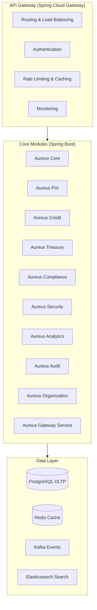

# 🏗️ AUREUS - Arquitetura Monolítica Modular

## 📋 Visão Geral

**Objetivo**: Definir a arquitetura monolítica modular para AUREUS, garantindo simplicidade, manutenibilidade e evolução gradual.

**Abordagem**: Arquitetura monolítica modular com Java Spring Boot, evoluindo para microserviços conforme necessário.

## 🎯 Princípios Arquiteturais

### **1. Monolito Modular**
- **Módulos**: Cada módulo é independente dentro do monólito
- **Escalabilidade**: Escala como um todo, com módulos específicos
- **Tecnologia**: Java Spring Boot para todos os módulos
- **Deploy**: Deploy único com módulos integrados

### **2. API-First**
- **REST**: APIs RESTful para integração
- **Swagger**: Documentação automática
- **Versionamento**: Versionamento de APIs
- **Gateway**: API Gateway para roteamento
- **Comunicação entre módulos**: padrão formalizado em [ADR-0001](adr/0001-comunicacao-entre-servicos.md) — REST com client gerado de OpenAPI para chamadas síncronas, Kafka com outbox transacional para eventos de domínio, saga coreografada para fluxos multi-módulo

### **3. Modularidade**
- **Separação**: Módulos bem definidos e separados
- **Reutilização**: Código compartilhado via aureus-shared
- **Evolução**: Preparado para evolução para microserviços
- **Manutenção**: Facilita manutenção e desenvolvimento

### **4. Simplicidade**
- **Deploy**: Deploy simples e direto
- **Debugging**: Debugging mais fácil
- **Desenvolvimento**: Desenvolvimento mais ágil
- **Testes**: Testes de integração mais simples

## 🏛️ Arquitetura de Alto Nível

## 🔧 Componentes Principais

### **1. API Gateway**
- **Tecnologia**: Spring Cloud Gateway
- **Funções**: Routing, load balancing, auth, rate limiting
- **Porta**: 8080
- **Health Check**: `/actuator/health`

### **2. Módulos Core (Spring Boot)**

#### **Aureus Core** ✅
- **Porta**: 8081
- **Funções**: Gestão de contas, clientes, transações básicas
- **Banco**: PostgreSQL
- **Cache**: Redis

#### **Aureus PIX** ✅
- **Porta**: 8082
- **Funções**: Pagamentos PIX, transferências
- **Banco**: PostgreSQL
- **Integração**: SPB (planejado)

#### **Aureus Credit** ✅
- **Porta**: 8083
- **Funções**: Crédito, análise de risco
- **Banco**: PostgreSQL

#### **Aureus Treasury** ✅
- **Porta**: 8084
- **Funções**: Tesouraria, investimentos
- **Banco**: PostgreSQL

#### **Aureus Security** ✅
- **Porta**: 8085
- **Funções**: Autenticação, autorização
- **Banco**: PostgreSQL

#### **Aureus Compliance** ✅
- **Porta**: 8086
- **Funções**: Conformidade, relatórios BACEN
- **Banco**: PostgreSQL

#### **Aureus Organization** ✅
- **Porta**: 8087
- **Funções**: Estrutura organizacional, controle de alçada
- **Banco**: PostgreSQL

#### **Aureus Analytics** ✅
- **Porta**: 8088
- **Funções**: Analytics, métricas, relatórios
- **Banco**: PostgreSQL

#### **Aureus Audit** ✅
- **Porta**: 8089
- **Funções**: Auditoria, logs, compliance
- **Banco**: PostgreSQL

## 🔄 Fluxo de Dados

### **Fluxo de Transação PIX:**

1. **Cliente** → API Gateway → Aureus PIX
2. **Aureus PIX** → Validação → Aureus Core
3. **Aureus Core** → Verificação de saldo → PostgreSQL
4. **Aureus PIX** → Processamento → SPB
5. **Evento** → Kafka → Todos os serviços
6. **Aureus Audit** → Log da transação → Elasticsearch
7. **Aureus Analytics** → Métricas → ClickHouse
8. **Resposta** → Cliente via API Gateway

### **Fluxo de Análise de Crédito:**

1. **Cliente** → API Gateway → Aureus Credit
2. **Aureus Credit** → Dados do cliente → Aureus Core
3. **Aureus Analytics** → Análise ML → ClickHouse
4. **Aureus Credit** → Decisão de crédito
5. **Evento** → Kafka → Aureus Audit
6. **Resposta** → Cliente

## 🛡️ Segurança

### **Autenticação e Autorização**
- **JWT**: Tokens para autenticação
- **OAuth2**: Autorização
- **RBAC**: Role-based access control
- **MFA**: Multi-factor authentication

### **Criptografia**
- **TLS**: Transport layer security
- **AES-256**: Criptografia de dados
- **RSA**: Chaves assimétricas
- **HSM**: Hardware security modules

### **Auditoria**
- **Logs**: Todos os acessos logados
- **Traces**: Distributed tracing
- **Métricas**: Performance e segurança
- **Alertas**: Detecção de anomalias

## 📊 Monitoramento

### **Observabilidade**
- **Logs**: ELK Stack (Elasticsearch, Logstash, Kibana)
- **Métricas**: Prometheus + Grafana
- **Traces**: Jaeger
- **APM**: DataDog

### **Health Checks**
- **Liveness**: Serviço está vivo
- **Readiness**: Serviço está pronto
- **Startup**: Serviço iniciou corretamente

### **Alertas**
- **Performance**: Latência alta
- **Erros**: Taxa de erro alta
- **Recursos**: CPU/Memória alta
- **Segurança**: Tentativas de invasão

## 🚀 Deploy e Escalabilidade

### **Containers**
- **Docker**: Empacotamento de aplicações
- **Multi-stage**: Builds otimizados
- **Security**: Imagens seguras

### **Orquestração**
- **Kubernetes**: Gerenciamento de containers
- **Helm**: Gerenciamento de releases
- **Istio**: Service mesh

### **Auto-scaling**
- **HPA**: Horizontal Pod Autoscaler
- **VPA**: Vertical Pod Autoscaler
- **Custom Metrics**: Métricas personalizadas

## 🔧 Configuração

### **Ambientes**
- **Development**: Desenvolvimento local
- **Staging**: Testes de integração
- **Production**: Ambiente de produção

### **Configuração**
- **ConfigMaps**: Configurações não sensíveis
- **Secrets**: Configurações sensíveis
- **Environment**: Variáveis de ambiente

### **Service Discovery**
- **Consul**: Service discovery
- **Eureka**: Service registry
- **Kubernetes**: DNS nativo

## 🎯 Conclusão

A arquitetura modular da AUREUS foi projetada para oferecer o equilíbrio ideal entre simplicidade operacional e flexibilidade para o futuro. Ao manter os domínios de negócio bem isolados, garantimos que a plataforma possa evoluir e escalar conforme a demanda, mantendo sempre a integridade e a segurança exigidas pelo mercado financeiro.

Para conferir o estágio atual de cada módulo e os próximos passos da plataforma, acesse o documento de **[Roadmap e Visão](../../01-business/roadmap.md)**.

---

**Última atualização**: Fevereiro 2026  
**Versão**: 1.2.0  
**Status**: Produção (Módulos Core Implementados)
