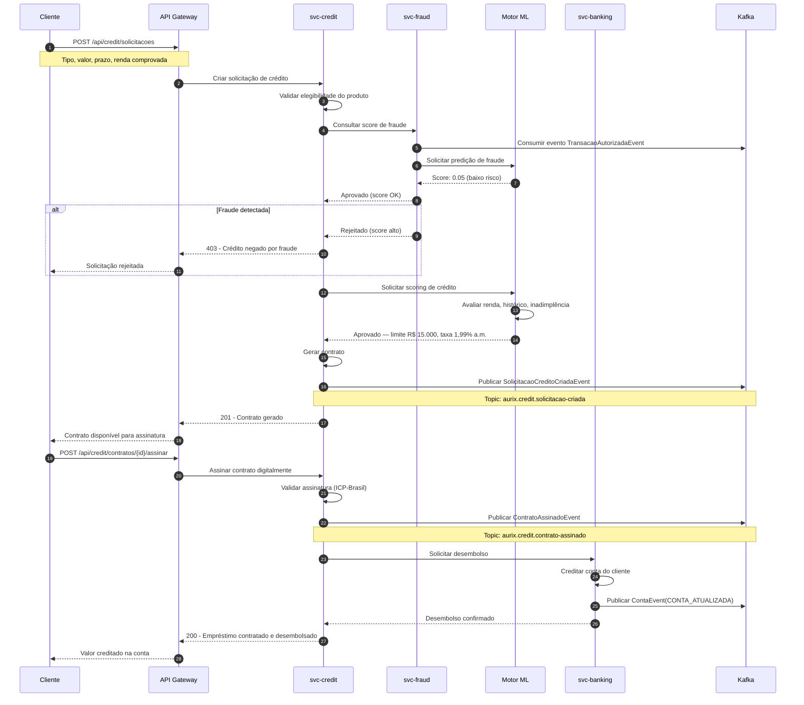

# Fluxo de Empréstimo

Diagrama de sequência do fluxo completo de concessão de crédito, desde a solicitação até o desembolso.

## Atividades

| Ator | Descrição |
|------|-----------|
| **Cliente** | Solicita crédito, assina contrato digital |
| **svc-credit** | Orquestração: elegibilidade, contrato, desembolso |
| **svc-fraud** | Análise de fraude anti-lavagem (AML) |
| **Motor ML** | Scoring de crédito e predição de default |
| **svc-banking** | Movimentação financeira — desembolso na conta |
| **Kafka** | Eventos assíncronos entre serviços |

## Cenários

1. **Renda insuficiente** → Rejeição antes do scoring de fraude
2. **Score ML baixo** → Proposta com condições diferenciadas (taxa maior)
3. **Garantia necessária** → Fluxo auxiliar: registro de garantia em cartório
4. **Consigado** → Margem verificada junto ao empregador antes da aprovação
