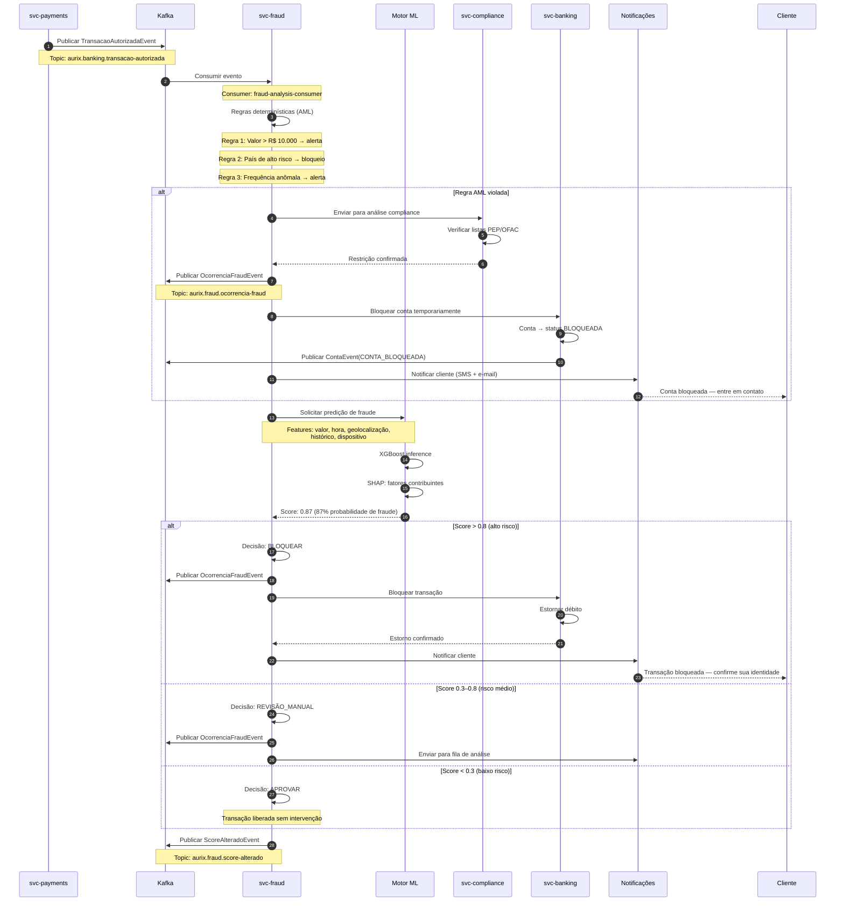

# Fluxo de Detecção de Fraude

Diagrama de sequência do fluxo de análise antifraude e AML (Anti-Money Laundering) em tempo real, desde a transação até a decisão de bloqueio ou aprovação.

## Atividades

| Ator | Descrição |
|------|-----------|
| **svc-payments** | Origem: transação autorizada |
| **Kafka** | Transporte de eventos entre serviços |
| **svc-fraud** | Orquestração: regras AML + integração com ML |
| **Motor ML** | Predição XGBoost com explicabilidade (SHAP) |
| **svc-compliance** | Listas PEP, OFAC, Sanções — AML regulatório |
| **svc-banking** | Execução: bloqueio, estorno, desbloqueio |
| **Notificações** | Alertas ao cliente (SMS, e-mail, push) |
| **Cliente** | Confirmação de identidade quando solicitado |

## Regras AML Implementadas

| Regra | Limite | Ação |
|-------|--------|------|
| Valor elevado | > R$ 10.000 | Alerta + revisão |
| País alto risco | Lista OFAC | Bloqueio imediato |
| Frequência anômala | > 10 transações/hora | Alerta |
| Horário atípico | 02:00–05:00 + valor alto | Alerta |
| Dispositivo novo | Primeira vez | Verificação 2FA |

## Decisões ML

| Score | Decisão | Ação |
|-------|---------|------|
| 0.0 – 0.3 | APROVAR | Sem intervenção |
| 0.3 – 0.8 | REVISÃO_MANUAL | Fila de análise |
| 0.8 – 1.0 | BLOQUEAR | Estorno + notificação |
