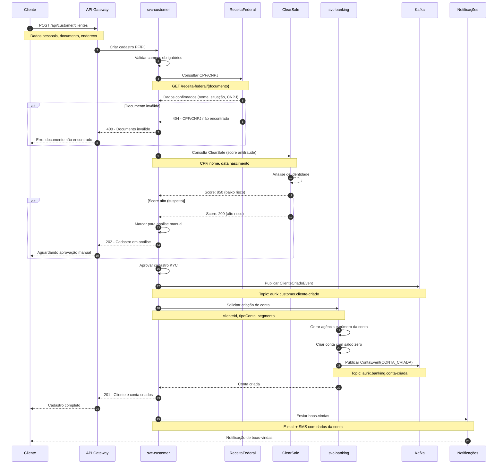

# Fluxo de Onboarding

Diagrama de sequência do cadastro de novos clientes (PF/PJ), incluindo validação KYC e criação de conta.

## Atividades

| Ator | Descrição |
|------|-----------|
| **Cliente** | Usuário que realiza o cadastro inicial |
| **API Gateway** | Traefik — roteamento e autenticação |
| **svc-customer** | Onboarding: cadastro, KYC, validação de documentos |
| **ReceitaFederal** | Validação de CPF/CNPJ junto à Receita |
| **ClearSale** | Score antifraude para validação de identidade |
| **svc-banking** | Criação da conta bancária |
| **Kafka** | Eventos de cliente criado e conta criada |
| **Notificações** | Envio de e-mail/SMS de boas-vindas |

## Cenários

1. **Pessoa Jurídica** → Fluxo adicional: consulta CNPJ, sócio, capital social
2. **Estrangeiro** → Validação de RNE/CRNM em vez de CPF
3. **Rejeição KYC** → Cadastro fica pendente; cliente pode reenviar documentos
4. **Regra LGPD** → Consentimento explícito antes do processamento dos dados
