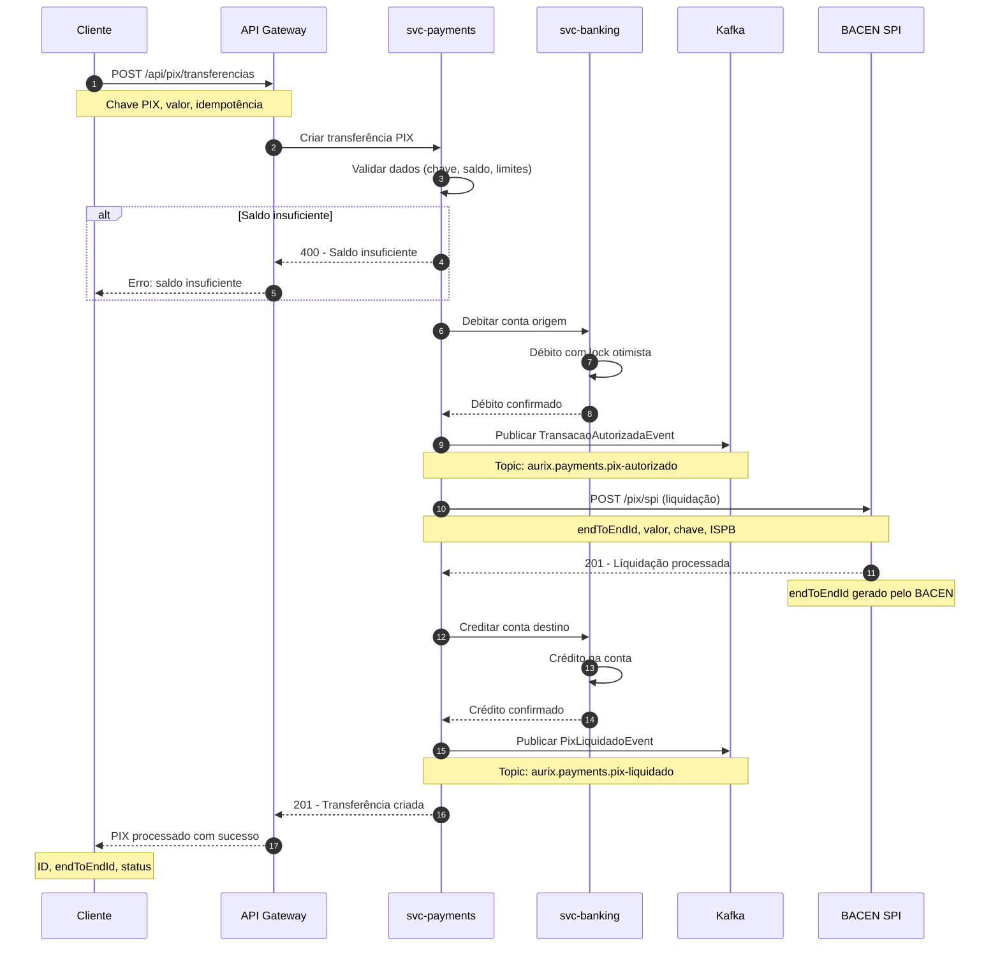

# Fluxo de Pagamento PIX

Diagrama de sequência do fluxo completo de uma transferência PIX, desde a criação até a liquidação via SPI do BACEN.

## Atividades

| Ator | Descrição |
|------|-----------|
| **Cliente** | Usuário final que inicia a transferência PIX |
| **API Gateway** | Traefik — roteamento, autenticação, rate limiting |
| **svc-payments** | Serviço de pagamentos — criação, validação e orquestração |
| **svc-banking** | Serviço core — débito/crédito em contas |
| **Kafka** | Broker de mensagens — eventos assíncronos |
| **BACEN SPI** | Sistema de Pagamentos Instantâneos do Banco Central |

## Cenários de Erro

1. **Saldo insuficiente** → Rejeição antes da chamada SPI
2. **Timeout SPI** → Retry com idempotência, estado PENDENTE
3. **Erro BACEN** → Estorno automático do débito, evento de falha
4. **Chave PIX inválida** → Validação via `/pix/chave/validar` antes do envio
