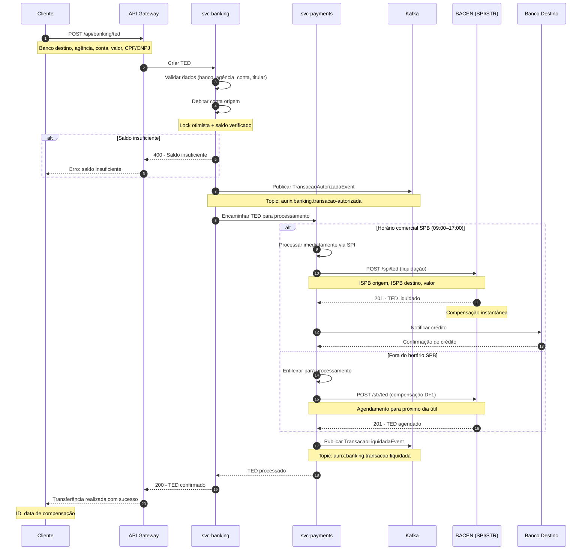

# Fluxo de TED

Diagrama de sequência do fluxo completo de uma transferência bancária (TED), desde a criação até a compensação via SPI/STR.

## Atividades

| Ator | Descrição |
|------|-----------|
| **Cliente** | Solicita a transferência TED |
| **API Gateway** | Traefik — autenticação e roteamento |
| **svc-banking** | Débito na conta, validação de dados bancários |
| **svc-payments** | Orquestração do envio ao BACEN |
| **Kafka** | Eventos de autorização e liquidação |
| **BACEN (SPI/STR)** | Sistema de Pagamentos Instantâneos ou STR (D+1) |
| **Banco Destino** | Instituição que recebe a transferência |

## Compensação

| Horário | Canal | Compensação |
|---------|-------|-------------|
| 09:00–17:00 (dia útil) | SPI | Instantânea (segundos) |
| Fora do horário | STR | D+1 (próximo dia útil) |
| Sábado/Domingo/feriado | STR | D+1 (próximo dia útil) |

## Cenários de Erro

1. **Conta destino inexistente** → BACEN rejeita, estorno automático
2. **ISPB inválido** → Validação prévia antes do envio
3. **Timeout SPI** → Retry com idempotência (max 3 tentativas)
4. **Valor acima do limite** → Exige autorização adicional (segundo fator)
