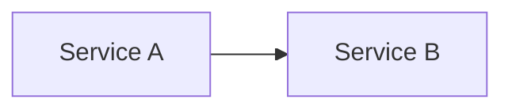

# Style Guide

## Format

All documentation is written in Markdown (.md) following GitHub Flavored Markdown (GFM).

## Structure

- `docs/architecture/` — system architecture diagrams and descriptions (C4 model)
- `docs/guides/` — development setup, deployment runbooks, troubleshooting
- `docs/decisions/` — Architecture Decision Records (ADRs) in template below

## ADR Template

```markdown
# ADR-{N}: {Title}

## Status

Proposed | Accepted | Deprecated | Superseded

## Context

...

## Decision

...

## Consequences

...
```

## Diagrams

Use Mermaid for inline diagrams in Markdown:


