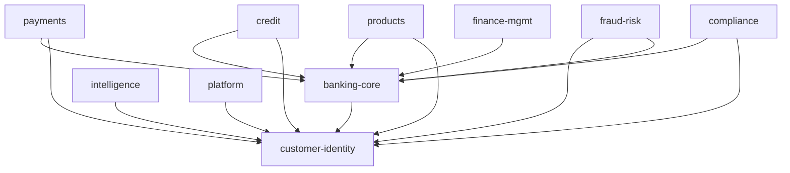

# Migração para 10 Domínios — Camada 2: Mapa de Domínios

> **Pré-requisito:** Camada 1 (infraestrutura) concluída — portas 8200–8209 reservadas, docker-compose.v2.yml, dynamic.v2.yml, CI/CD, Makefile.
> **Não cobre:** Banco por domínio, tópicos Kafka — esses são Camada 3.

---

## Sumário

43 módulos → 10 domínios, com critérios rigorosos de boundary de domínio. Cada entidade e serviço mapeado para exatamente um domínio alvo. Entidades duplicadas são consolidadas em uma única representação no domínio dono.

---

## 1. Mapa Domínio → Módulos Originais

### banking-core (svc-banking, 8200)

| Módulos fonte | Entidades que entram | Serviços que entram |
|---|---|---|
| `aureus-core` | `Conta`, `MovimentoConta`, `Transacao`, `Liquidacao`, `CalculoRemuneracao`, `SistemaRemuneracao`, `ControleSaldo`, `PacoteTarifas`, `Tarifa`, `CobrancaTarifa`, `ContaTarifa`, `AgendamentoDebito`, `AplicacaoFinanceira` | `ContaService`, `TransacaoService`, `LiquidacaoService`, `MotorTarifasService`, `ControleSaldoService`, `SistemaRemuneracaoService`, `AgendamentoDebitoService` |
| `aureus-poupanca` | `ContaPoupanca`, `MovimentacaoPoupanca` | `ContaPoupancaService`, `MovimentacaoService`, `AniversarioService`, `ExtratoPdfService` |
| `aureus-salario` | `ContaSalario`, `ConvenioEmpresa`, `FolhaPagamento`, `ItemFolhaPagamento`, `SolicitacaoPortabilidade` | `ContaSalarioService`, `ConvenioService`, `FolhaService`, `PortabilidadeService`, `CnabService` |
| `aureus-settlement` | `ConciliacaoBancaria`, `Liquidez`, `SaldoConta` | `SettlementService` |
| `aureus-pricing` | — (Tarifas migram do core) | `PricingEngineService` |

**Justificativa:** Conta, saldo, transação, liquidação e tarifas são o mesmo ciclo de vida de uma transação bancária. Poupança e salário são tipos de conta com regras específicas, não bounded contexts independentes.

**Controllers finais:** `ContaController`, `TransacaoController`, `ContaPoupancaController`, `ContaSalarioController`, `SettlementController`, `PricingController`, `LiquidacaoController`, `ExtratoController`, `AniversarioController`, `AgendamentoDebitoController`, `MotorTarifasController`, `SistemaRemuneracaoController`, `ControleSaldoController`

---

### payments (svc-payments, 8201)

| Módulos fonte | Entidades que entram | Serviços que entram |
|---|---|---|
| `aureus-core` | `Boleto`, `AgendamentoDebito` | `BoletoService` |
| `aureus-pix` | `PixChave`, `PixTransferencia` | `PixChaveService`, `PixTransferenciaService`, `QrPixService` |
| `aureus-bacen` | `TransacaoSPI`, `TransacaoSTR`, `TaxaSelic`, `SpreadBancario`, `Liquidez` | `SpiStrIntegrationService`, `BacenIntegrationService` |

**Justificativa:** PIX é o principal meio de pagamento, integra diretamente com SPI/STR (BACEN). TED/DOC e boleto também são meios de pagamento — mesmo ciclo.

**Nota:** Relatórios BACEN (Cosif, RelatorioBacen) migram para compliance. Câmbio migra para products.

**Controllers finais:** `PixChaveController`, `PixTransferenciaController`, `QrPixController`, `BoletoController`, `SpiStrController`

---

### credit (svc-credit, 8202)

| Módulos fonte | Entidades que entram | Serviços que entram |
|---|---|---|
| `aureus-credit` | `ProdutoCredito`, `SolicitacaoCredito` | `DecisaoCreditoService`, `ProdutoCreditoService`, `SimuladorCreditoService`, `SolicitacaoCreditoService` |
| `aureus-consignado` | `ContratoConsignado`, `ConvenioConsignado`, `MargemConsignavel`, `Parcela`, `ConsignadoSource` | `ContratoConsignadoService`, `ConvenioService`, `MargemService`, `ParcelaService` |
| `aureus-financiamento` | `ContratoFinanciamento`, `SimulacaoFinanciamento`, `ParcelaFinanciamento`, `BemFinanciado`, `Garantia` | `ContratoFinanciamentoService`, `AmortizacaoService`, `SimulacaoService`, `ParcelaService`, `GarantiaService`, `AdminService` |

**Justificativa:** Todos os produtos de crédito (livre, consignado, financiamento) compartilham o mesmo core: análise de risco, contrato, parcelas, amortização. Garantia é específica de financiamento mas faz parte do mesmo domínio.

**Controllers finais:** `SolicitacaoCreditoController`, `DecisaoCreditoController`, `SimuladorCreditoController`, `ContratoConsignadoController`, `MargemController`, `ContratoController`, `SimulacaoController`, `BemController`, `GarantiaController`, `AdminController`

---

### products (svc-products, 8203)

| Módulos fonte | Entidades que entram | Serviços que entram |
|---|---|---|
| `aureus-investimento` | `Carteira`, `ContaInvestimento`, `OrdemInvestimento`, `ProdutoInvestimento` | `CarteiraService`, `ContaInvestimentoService`, `OrdemService`, `ProdutoInvestimentoService` |
| `aureus-cambio` | `ClienteCambio`, `ContaCambio`, `ContratoCambio`, `Cotacao`, `OperacaoCambio`, `Remessa` | `ClienteCambioService`, `ComplianceCambialService`, `ContratoCambioService`, `CotacaoService`, `RemessaService` |
| `aureus-seguros` | `Apolice`, `Corretor`, `CotacaoSeguro`, `ParcelaPremio`, `ProdutoSeguro`, `Sinistro`, `Tomador`, `Comissao` | `CotacaoSeguroService`, `EmissaoService`, `ProdutoSeguroService`, `SinistroService`, `CorretorService`, `ComissaoService`, `ParcelaService` |
| `aureus-cartoes` | `Cartao`, `Fatura`, `LancamentoFatura`, `LimiteCartao`, `ProdutoCartao`, `TransacaoCartao`, `ParceiroAdquirente`, `ParceiroBandeira` | `CartaoService`, `CartaoQueryService`, `EmissaoService`, `FaturaService`, `LimiteService`, `ParceiroService`, `ProdutoCartaoService`, `TransacaoService` |
| `aureus-treasury` | — (usa Investimento) | `InvestimentoService`, `TesourariaAvancadaService` |
| `aureus-guarantee` | `Bem`, `Avaliacao`, `RegistroGarantia` | — |

**Controllers finais:** `ContaInvestimentoController`, `OrdemController`, `ProdutoInvestimentoController`, `ContratoCambioController`, `CotacaoController`, `RemessaController`, `ApoliceController`, `SinistroController`, `CotacaoController`, `ProdutoSeguroController`, `CartaoController`, `FaturaController`, `LimiteController`, `ProdutoCartaoController`, `TransacaoController`

---

### customer-identity (svc-customer, 8204)

| Módulos fonte | Entidades que entram | Serviços que entram |
|---|---|---|
| `aureus-customer` | `Cliente`, `Contato`, `Endereco` | `ClienteService` |
| `aureus-kyc` | `DocumentoKYC`, `ScoreKYC`, `SolicitacaoKYC` | `SolicitacaoKycService` |
| `aureus-onboarding` | `SolicitacaoOnboarding`, `DocumentoOnboarding`, `SolicitacaoPF`, `SolicitacaoPJ`, `Empresa`, `Participante`, `Pep`, `HistoricoAprovacao` | `OnboardingPFService`, `OnboardingPJService` (com integrações Bureau/Serasa/Quod) |
| `aureus-security` | `MfaConfig`, `MfaToken`, `PasswordResetToken`, `RefreshToken` | `AuthService`, `JwtService`, `MfaService`, `PermissaoGranularService` |

**Justificativa:** Cliente, identidade, onboarding, KYC e autenticação formam o agregado de identidade. Security não é infra cross-cutting — é gestão de identidade do cliente.

**Controllers finais:** `ClienteController`, `SolicitacaoKycController`, `ControllerPF`, `ControllerPJ`, `AuthController`, `CriptografiaController`, `MfaController`, `PermissaoGranularController`

---

### fraud-risk (svc-fraud, 8205)

| Módulos fonte | Entidades que entram | Serviços que entram |
|---|---|---|
| `aureus-fraud` | `ScoreTransacao`, `OcorrenciaFraude`, `RegraFraude`, `BloqueioPreventivo` | `FraudScoringService` |
| `aureus-analytics` | `CreditScore` | `CreditScoreServiceProd`, `MlFraudServiceProd` |

**Justificativa:** Fraude e scoring de crédito compartilham modelo de risco em tempo real. Analytics contribui com modelos ML de fraude.

**Controllers finais:** `FraudController`, `MlController` (parte de fraude)

---

### compliance (svc-compliance, 8206)

| Módulos fonte | Entidades que entram | Serviços que entram |
|---|---|---|
| `aureus-compliance` | `ConsentimentoLGPD`, `AnonimizacaoDados`, `PortabilidadeDados`, `DireitoEsquecimento` | `LgpdService`, `RegulacaoService` |
| `aureus-audit` | `LogAuditoria` (via shared) | `LogAuditoriaService` |
| `aureus-tax` | `Imposto`, `RetencaoImposto`, `SPED`, `ComplianceFiscal` | `ImpostoService` |
| `aureus-accounting` | `PlanoContas`, `LancamentoContabil`, `ItemLancamentoContabil`, `ConciliacaoBancaria`, `RelatorioContabil`, `SaldoConta` | `ClassificationService`, `IFRS9Service`, `RelatorioIFRS9Service`, `RiskAssessmentService`, `ECLCalculationService`, `HedgeAccountingService` |
| `aureus-bacen` | `RelatorioBacen`, `Liquidez` | `RelatoriosBacenService`, `CosifReportGenerator` |

**Justificativa:** Compliance, auditoria, impostos e contabilidade formam o domínio regulatório-fiscal. IFRS9 e SPED são reportes regulatórios. BACEN Cosif é reporte também.

**Controllers finais:** `LgpdController`, `RegulacaoController`, `LogAuditoriaController`, `ImpostoController`, `IFRS9Controller`, `RelatoriosBacenController`

---

### finance-mgmt (svc-finance-mgmt, 8207)

| Módulos fonte | Entidades que entram | Serviços que entram |
|---|---|---|
| `aureus-controller` | `Orcamento`, `ItemOrcamento`, `PlanejamentoEstrategico`, `CentroCusto`, `KPI` | `OrcamentoService` |
| `aureus-budget` | `Orcamento`, `ItemOrcamento`, `PlanejamentoEstrategico`, `VersaoOrcamento` | `OrcamentoService` |
| `aureus-cost` | `CentroCusto`, `Custo`, `Rentabilidade`, `Atividade` | `CustoService` |
| `aureus-financial` | `ContaPagar`, `ContaReceber`, `FluxoCaixa`, `PerfilFinanceiroCliente`, `Fornecedor` | `ContaPagarService`, `PerfilFinanceiroClienteService` |

**Justificativa:** Controladoria, orçamento, custo e contas a pagar/receber formam o domínio de gestão financeira interna. Não confundir com contabilidade regulatória (compliance).

**Atenção:** `ConciliacaoBancaria` de `aureus-financial` NÃO entra aqui — a versão canônica fica em compliance (accounting).

**Controllers finais:** `OrcamentoController`, `CustoController`, `ContaPagarController`, `PerfilFinanceiroClienteController`

---

### platform (svc-platform, 8208)

| Módulos fonte | Entidades que entram | Serviços que entram |
|---|---|---|
| `aureus-provisioning` | `TenantConfig`, `TenantFeatureFlag`, `Instituicao` | `TenantConfigService`, `TenantFeatureFlagService`, `InstituicaoService` |
| `aureus-billing` | `Fatura`, `Plano`, `UsoMensal` | `BillingService`, `PlanoService`, `StripeServiceStub`, `UsoService` |
| `aureus-webhooks` | `WebhookConfig`, `WebhookLog` | `WebhookConfigService`, `WebhookSenderService` |
| `aureus-notification` | `PreferenciaCliente`, `TemplateNotificacao`, `FilaNotificacao`, `ConfirmacaoRecebimento` | `NotificacaoService` |
| `aureus-catalog` | `Produto`, `Oferta`, `Campanha`, `Segmento`, `Categoria`, `PoliticaElegibilidade`, `CondicaoComercial`, `FamiliaProduto`, `ConfigCartao`, `ConfigConta`, `ConfigCredito` (28 entidades) | `CatalogoService`, `OfertaService`, `ProdutoService`, `CampanhaService`, `ElegibilidadeService`, `ConfigService` |
| `aureus-baas` | `ParceiroCustodia`, `SubContaCustodia`, `ConsentimentoCustodia` | `CustodiaService` |
| `aureus-organization` | `Empresa`, `Departamento`, `Cargo`, `Funcionario`, `Workflow`, `Aprovacao`, `ControleAlcada`, `DelegacaoPoder` | `EmpresaService`, `FuncionarioService`, `WorkflowService`, `ControleAlcadaService` |

**Justificativa:** Serviços de plataforma SaaS (provisioning, billing, catalog, notificação, webhooks, organização). Não são domínio bancário — são infraestrutura da plataforma.

**Controllers finais:** `TenantConfigController`, `InstituicaoController`, `FaturaController`, `PlanoController`, `UsoController`, `WebhookConfigController`, `WebhookDispatchController`, `NotificacaoController`, `CatalogoController`, `OfertaController`, `ProdutoController`, `CampanhaController`, `ElegibilidadeController`, `CustodiaController`, `ParceiroController`, `EmpresaController`, `FuncionarioController`, `WorkflowController`, `ControleAlcadaController`

---

### intelligence (svc-intelligence, 8209)

| Módulos fonte | Entidades que entram | Serviços que entram |
|---|---|---|
| `aureus-analytics` | — (analytics-based entities) | `BiService`, `ChatbotService`, `MetricaService` |
| `aureus-ai` | — | `AureusAgentFactory` |
| `aureus-openfinance` | `ConsentimentoOpenFinance`, `LogAcessoOpenFinance`, `TokenOpenFinance` | `ConsentimentoOpenFinanceService`, `OpenFinanceDataService`, `RateLimitService`, `TokenOpenFinanceService` |
| `aureus-internet-banking` | `SessaoInternetBanking`, `TransacaoInternetBanking`, `LogAtividadeInternetBanking` | `InternetBankingService` |
| `aureus-mobile-banking` | `SessaoMobile`, `DispositivoMobile`, `NotificacaoMobile` | `MobileBankingService` |

**Justificativa:** Inteligência de negócio (BI, analytics, AI/ML) combinada com canais digitais (internet banking, mobile banking) e Open Finance. Canais digitais são camadas de apresentação thin — não têm domínio próprio.

**Controllers finais:** `BiController`, `ChatbotController`, `MetricaController`, `ConsentimentoOpenFinanceController`, `OpenFinanceController`, `TokenOpenFinanceController`, `InternetBankingController`, `MobileBankingController`

---

## 2. Entidades Duplicadas — Resolução

| Entidade | Aparece em | Versão canônica em | Motivo |
|---|---|---|---|
| `ConciliacaoBancaria` | core, financial, settlement, accounting | **compliance** | Accounting é o dono da verdade contábil |
| `SaldoConta` | accounting, settlement | **compliance** (accounting) | Dono é contabilidade |
| `OutboxEvent` / `OutboxRelay` | core, pix, settlement | **aureus-shared** | Padrão técnico, não entidade de domínio — vira shared library |
| `PacoteTarifas` / `Tarifa` | core, pricing | **banking-core** | Tarifação é do core bancário |
| `PerfilRisco` / `AvaliacaoRisco` / `RegraRisco` | core, compliance, fraud | **fraud-risk** | Risco operacional é do domínio de fraude |
| `Orcamento` / `PlanejamentoEstrategico` | controller, budget | **finance-mgmt** | Merge dos dois módulos |
| `CentroCusto` | controller, cost | **finance-mgmt** | Merge dos dois módulos |
| `Cliente` | customer, core, shared | **customer-identity** | Cliente é dono do agregado de identidade |

## 3. Shared Library Strategy

`aureus-shared` permanece como biblioteca Java (não serviço). Contém:

- **Event classes:** `OutboxEvent`, mensagens tipadas por domínio (ADR-0001)
- **Base entities:** `BaseEntity`, `Auditable` — classes base, não entidades de domínio
- **DTOs compartilhados:** `PageRequest`, `ApiResponse`, `ErrorResponse`
- **Utilitários:** `DateUtils`, `CpfCnpjUtils`, `CurrencyUtils`

**O que SAI do shared:** `Cliente`, `Conta`, `Transacao`, `PixChave`, `PixTransferencia` — essas entidades são copiadas (uma vez) para seus domínios donos e removidas do shared. DTOs permanecem no shared para comunicação entre domínios via Kafka/API.

---

## 4. Dependências entre Domínios

- **banking-core** e **customer-identity** são os domínios fundamentais — todos os outros dependem deles.
- **Nenhum domínio** depende de finance-mgmt, intelligence, platform ou compliance (são consumidores de dados, não provedores).
- Dependências são resolvidas via **chamadas síncronas (Feign/HTTP)** entre serviços durante a migração, e posteriormente migradas para **eventos assíncronos (Kafka)** sempre que possível.

---

## 5. Ordem de Merge dos 43 Módulos

A ordem segue dependências (domínios sem dependências primeiro):

| Fase | Domínio | Merge destes módulos | Ação |
|:---:|---|---|---|
| F1 | `customer-identity` | `aureus-customer` + `aureus-kyc` + `aureus-onboarding` + `aureus-security` | Merge |
| F2 | `banking-core` | `aureus-core` + `aureus-poupanca` + `aureus-salario` + `aureus-pricing` + `aureus-settlement` | Merge |
| F3 | `payments` | `aureus-pix` + `aureus-bacen` (SPI/STR) | Merge |
| F4 | `credit` | `aureus-credit` + `aureus-consignado` + `aureus-financiamento` | Merge |
| F5 | `products` | `aureus-investimento` + `aureus-cambio` + `aureus-seguros` + `aureus-cartoes` + `aureus-treasury` + `aureus-guarantee` | Merge |
| F6 | `fraud-risk` | `aureus-fraud` + modelos ML de `aureus-analytics` | Merge |
| F7 | `compliance` | `aureus-compliance` + `aureus-audit` + `aureus-tax` + `aureus-accounting` + `aureus-bacen` (relatórios) | Merge |
| F8 | `finance-mgmt` | `aureus-controller` + `aureus-budget` + `aureus-cost` + `aureus-financial` | Merge |
| F9 | `platform` | `aureus-provisioning` + `aureus-billing` + `aureus-webhooks` + `aureus-notification` + `aureus-catalog` + `aureus-baas` + `aureus-organization` | Merge |
| F10 | `intelligence` | `aureus-analytics` + `aureus-ai` + `aureus-openfinance` + `aureus-internet-banking` + `aureus-mobile-banking` | Merge |

**Nota:** `aureus-gateway` é eliminado (Traefik já é o gateway real). `aureus-shared` permanece como biblioteca.

---

## 6. Mapa de Portas + Context Paths (atualizado)

| Domínio | Serviço | Porta | Management | Context Paths (prefixos Traefik) |
|---------|---------|:----:|:----------:|------|
| Banking Core | svc-banking | 8200 | 9200 | `/api/core`, `/api/contas`, `/api/transacoes`, `/api/poupanca`, `/api/salario`, `/api/settlement`, `/api/pricing` |
| Payments | svc-payments | 8201 | 9201 | `/api/pix`, `/api/boleto`, `/api/spi`, `/api/str`, `/api/agendamento` |
| Credit | svc-credit | 8202 | 9202 | `/api/credit`, `/api/consignado`, `/api/financiamento` |
| Products | svc-products | 8203 | 9203 | `/api/investimento`, `/api/cambio`, `/api/seguros`, `/api/cartoes`, `/api/treasury` |
| Customer Identity | svc-customer | 8204 | 9204 | `/api/customer`, `/api/kyc`, `/api/onboarding`, `/api/auth`, `/api/mfa`, `/api/security` |
| Fraud & Risk | svc-fraud | 8205 | 9205 | `/api/fraud`, `/api/risk`, `/api/ml` |
| Compliance | svc-compliance | 8206 | 9206 | `/api/compliance`, `/api/audit`, `/api/bacen`, `/api/tax`, `/api/accounting` |
| Finance Mgmt | svc-finance-mgmt | 8207 | 9207 | `/api/controller`, `/api/budget`, `/api/cost`, `/api/financial` |
| Platform | svc-platform | 8208 | 9208 | `/api/billing`, `/api/provisioning`, `/api/webhooks`, `/api/notification`, `/api/catalog`, `/api/baas`, `/api/organization` |
| Intelligence | svc-intelligence | 8209 | 9209 | `/api/ai`, `/api/analytics`, `/api/openfinance`, `/api/internet-banking`, `/api/mobile-banking` |

---

*Referência: architecture_critique.md (análise crítica de 43 módulos) — design dos 10 domínios aprovado em Julho/2026.*
